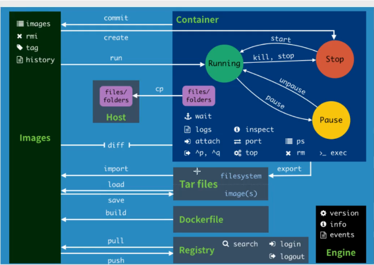
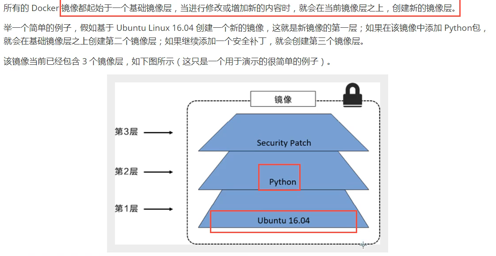
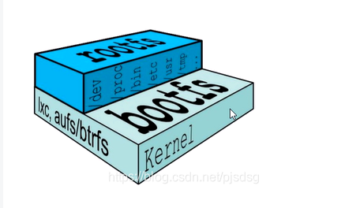
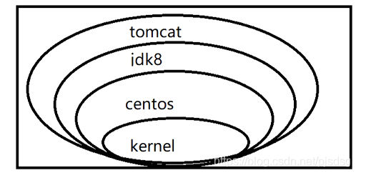
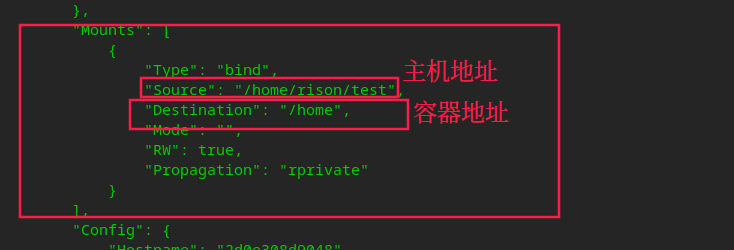
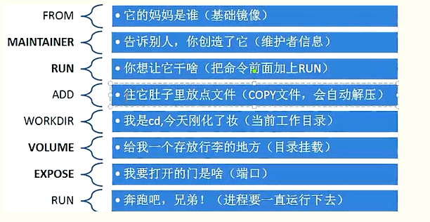

### 一 、Docker的介绍

* Docker时Docker.Lnc公司开源的一个基于LXC技术之上搭建的Container容器引擎，源代码托管在Github上

*  基于Go语言并遵从Apache2.0协议开源。

* Docker属于Linux容器的一种封装，提供简单易用的容器使用接口。

* Docker将应用程序与该程序的依赖，打包在一个文件里面。运行这个文件，就会生成一个虚拟容器。程序在这个虚拟容器里运行，就好像在真实的物理机上运行一样。有了Docker，就不用担心环境问题。

* 总体来说，Docker的接口相当简单，用户可以方便地创建和使用容器，把自己的应用放入容器。容器还可以进行版本管理、复制、分享、修改，就像管理普通的代码一样。

  

### 二、 Docker的概念

> ```scheme
> Docker是开发人员和系统管理员使用容器开发、部署和运行应用程序的平台。使用Linux容器来部署应用程序称为集装箱化。使用docker轻松部署应用程序。
> ```

**集装箱化的优点：**

- 灵活：即使是复杂的应用程序也可封装。
- 轻量级：容器利用并共享主机内核。
- 便携式：您可以在本地构建，部署到云上并在任何地方运行。
- 可扩展性：您可以增加和自动分发容器副本。
- 可堆叠：您可以垂直堆叠服务并及时并及时堆叠服务。

**采用 images 和容器**

> ```scheme
> 通过运行images启动容器，一个images是一个可执行的包，其中包括运行应用程序所需要的所有内容-代码，运行时，库、环境变量和配置文件。
> 容器时images运行时示例-当被执行时(即，images状态，或者用户进程)在内存中，可以使用命令查看正在运行容器的列表docker ps,就像在Linux中一样。
> ```

***对比传统技术： 虚拟机***

>```scheme
>虚拟机(virtual machine)就是带环境安装的一种解决方案。它可以在一种操作系统里面运行另一种操作系统，比如在Windows系统里面运行Linux系统。应用程序对此毫无感知，因为虚拟机看上去跟真丝系统一模一样，而对于底层系统来说，虚拟机就是一个普通文件，不需要了就删掉，对其它部分毫无影响。
>```

**虚拟机的缺点：**

- **资源占用多：**虚拟机会独占一部分内存和硬盘空间。它运行的时候，其他程序就不能使用这些资源了。哪怕虚拟机里面的应用程序，真正使用的内存只有1M，虚拟机依然需要几百MB的内容才能运行。
- **冗余步骤多：**虚拟机是完整的操作系统，一些系统级别的操作步骤，往往无法跳过，比如用户登录。
- **启动慢：**启动操作系统需要多久，启动虚拟机就需要多久。可能要等几分钟，应用陈故乡才能真正运行。

**linux容器**

> ```scheme
> 由于虚拟机存在这个缺点，Linux发展出了另一种虚拟化技术：Linux容器(Linux Containers,缩写为LXC)。
> Linux容器不是模拟一个完整的操作系统，而是对进程进行隔离。或者说，在正常进程的外面套了一个保护层。对于容器里面的进程来说，它接触到的各种资源都是虚拟的，从而实现与底层系统的隔离。由于容器是进程级别的，相比虚拟机又很多优势。
> ```

- **启动快：**容器里面的应用，直接就是底层系统的一个进程，而不是虚拟机内部的进程。所以，启动容器相当于启动本机的一个进程，而不是启动一个操作系统，速度就快很多。

- **资源占用少：**容器只占用需要的资源，不占用那些没有用到的资源；虚拟机由于是完整的操作系统，不可避免要占用所以资源。另外，多个容器可以共享资源，虚拟机都是独享资源。

- 体积小：容器只要包含用到的组件即可，而虚拟机是整个操作系统的打包，所以容器文件比虚拟机文件要小很多。总之，容器有点像轻量级的虚拟机，能够提供虚拟化的环境，但是成本开销小得多。

  

  


### 三、Docker安装

* 环境准备

  * Deepin

* 环境查看

  ~~~ shell
  # 系统内核 5.10以上
  rison@rison-PC:~/Desktop$ uname -r
  5.10.29-amd64-desktop
  (base) rison@rison-PC:~/Desktop$ cat /etc/os-release 
  PRETTY_NAME="Deepin 20.2.1"
  NAME="Deepin"
  VERSION_ID="20.2.1"
  VERSION="20.2.1"
  ID=Deepin
  HOME_URL="https://www.deepin.org/"
  BUG_REPORT_URL="https://bbs.deepin.org/"
  ~~~

  

* 安装 

[docker官网](https://docs.docker.com/)


**帮助文档**

~~~shell
#1、卸载旧的版本
 sudo apt-get remove docker docker-engine docker.io containerd runc
 
#2、更新apt包索引并安装包以允许apt通过 HTTPS 使用存储库：
 sudo apt-get update
 sudo apt-get install \
    apt-transport-https \
    ca-certificates \
    curl \
    gnupg \
    lsb-release
#3、添加docker官方的秘钥
 curl -fsSL https://download.docker.com/linux/debian/gpg | sudo gpg --dearmor -o /usr/share/keyrings/docker-archive-keyring.gpg
 
#4、设置稳定的存储库
 echo \
  "deb [arch=amd64 signed-by=/usr/share/keyrings/docker-archive-keyring.gpg] https://download.docker.com/linux/debian \
  $(lsb_release -cs) stable" | sudo tee /etc/apt/sources.list.d/docker.list > /dev/null
  
#5、安装docker引擎
 sudo apt-get update
 sudo apt-get install docker-ce docker-ce-cli containerd.io
 
#6、测试是否安装成功
(base) rison@rison-PC:~/Desktop$ docker --version
Docker version 19.03.8, build 1b4342cd4c
(base) rison@rison-PC:~/Desktop$ sudo docker run hello-world
Unable to find image 'hello-world:latest' locally
latest: Pulling from library/hello-world
b8dfde127a29: Pull complete 
Digest: sha256:9f6ad537c5132bcce57f7a0a20e317228d382c3cd61edae14650eec68b2b345c
Status: Downloaded newer image for hello-world:latest

Hello from Docker!
This message shows that your installation appears to be working correctly.

To generate this message, Docker took the following steps:
 1. The Docker client contacted the Docker daemon.
 2. The Docker daemon pulled the "hello-world" image from the Docker Hub.
    (amd64)
 3. The Docker daemon created a new container from that image which runs the
    executable that produces the output you are currently reading.
 4. The Docker daemon streamed that output to the Docker client, which sent it
    to your terminal.

To try something more ambitious, you can run an Ubuntu container with:
 $ docker run -it ubuntu bash

Share images, automate workflows, and more with a free Docker ID:
 https://hub.docker.com/

For more examples and ideas, visit:
 https://docs.docker.com/get-started/

~~~

### 四、docke运行流程


**docker工作原理**

Docker是一个client-server结构的系统，Docker的守护进程运行在主机上，通过socket从客户端访问！

DockerServer接收到DockerClient的指令，就会执行这个命令！


### 五、docker常用命令

~~~shell
rison@rison-PC:~/Desktop$ docker version  #显示版本信息
rison@rison-PC:~/Desktop$ docker info #显示系统信息，包括镜像和容器的数量
rison@rison-PC:~/Desktop$ docker --help #帮助命令
~~~

**镜像命令**

~~~shell
rison@rison-PC:~/Desktop$ docker images # 查看所有本地主机的镜像
REPOSITORY          TAG                 IMAGE ID            CREATED             SIZE
hello-world         latest              d1165f221234        3 months ago        13.3kB

# 解释
REPOSITORY # 镜像的仓库源
TAG #镜像版本
IMAGE ID #镜像的ID
CREATED #镜像的创建时间
SIZE #镜像的大小

# 可选项
Options:
  -a, --all             Show all images (default hides intermediate images)
      --digests         Show digests
  -f, --filter filter   Filter output based on conditions provided
      --format string   Pretty-print images using a Go template
      --no-trunc        Don't truncate output
  -q, --quiet           Only show numeric IDs


# docker search 搜索镜像
rison@rison-PC:~/Desktop$ docker search mysql
NAME                              DESCRIPTION                                     STARS               OFFICIAL            AUTOMATED
mysql                             MySQL is a widely used, open-source relation…   11057               [OK]                
mariadb                           MariaDB Server is a high performing open sou…   4193       
# 可选项
Options:
  -f, --filter filter   Filter output based on conditions provided
      --format string   Pretty-print search using a Go template
      --limit int       Max number of search results (default 25)
      --no-trunc        Don't truncate output

--filter=STARS=3000

rison@rison-PC:~/Desktop$ docker search mysql --filter=STARS=3000
NAME                DESCRIPTION                                     STARS               OFFICIAL            AUTOMATED
mysql               MySQL is a widely used, open-source relation…   11057               [OK]                
mariadb             MariaDB Server is a high performing open sou…   4193                [OK] 

# docker pull 下载镜像 默认是最新的版本可以在后面添加 [:tag]来指定版本
rison@rison-PC:~/Desktop$ docker pull mysql 
Using default tag: latest
latest: Pulling from library/mysql
b4d181a07f80: Pull complete 
a462b60610f5: Pull complete 
578fafb77ab8: Pull complete 
524046006037: Pull complete 
d0cbe54c8855: Pull complete 
aa18e05cc46d: Pull complete 
32ca814c833f: Pull complete 
9ecc8abdb7f5: Pull complete 
ad042b682e0f: Pull complete 
71d327c6bb78: Pull complete 
165d1d10a3fa: Pull complete 
2f40c47d0626: Pull complete 
Digest: sha256:52b8406e4c32b8cf0557f1b74517e14c5393aff5cf0384eff62d9e81f4985d4b
Status: Downloaded newer image for mysql:latest
docker.io/library/mysql:latest

# 之前存在的可以复用，分层概念
rison@rison-PC:~/Desktop$ docker pull mysql:5.7
5.7: Pulling from library/mysql
b4d181a07f80: Already exists 
a462b60610f5: Already exists 
578fafb77ab8: Already exists 
524046006037: Already exists 
d0cbe54c8855: Already exists 
aa18e05cc46d: Already exists 
32ca814c833f: Already exists 
52645b4af634: Pull complete 
bca6a5b14385: Pull complete 
309f36297c75: Pull complete 
7d75cacde0f8: Pull complete 
Digest: sha256:1a2f9cd257e75cc80e9118b303d1648366bc2049101449bf2c8d82b022ea86b7
Status: Downloaded newer image for mysql:5.7
docker.io/library/mysql:5.7


#删除镜像
rison@rison-PC:~/Desktop$ docker rmi -f 09361feeb475
Untagged: mysql:5.7
Untagged: mysql@sha256:1a2f9cd257e75cc80e9118b303d1648366bc2049101449bf2c8d82b022ea86b7
Deleted: sha256:09361feeb4753ac9da80ead4d46e2b21247712c13c9ee3f1e5d55630c64c544f
Deleted: sha256:e454d1e47d2f346e0b2365c612cb6f12476ac4a3568ad5f62d96aa15bccf3e19
Deleted: sha256:e0457c6e331916c8ac6838ef4b22a6f62b21698facf4e143aa4b3863f08cf7d2
Deleted: sha256:ed73046ee2cd915c08ed37a545e1b89da70dc9bafeacfbd9fddff8f967373941
Deleted: sha256:419d7a76abf4ca51b81821da16a6c8ca6b59d02a0f95598a2605a1ed77c012eb

#全部删除
rison@rison-PC:~/Desktop$ docker rmi -f $(docker images -aq)

~~~

**容器命令**

* 有了镜像才能创建容器

~~~shell
rison@rison-PC:~/Desktop$ docker pull centos
Using default tag: latest
latest: Pulling from library/centos
7a0437f04f83: Pull complete 
Digest: sha256:5528e8b1b1719d34604c87e11dcd1c0a20bedf46e83b5632cdeac91b8c04efc1
Status: Downloaded newer image for centos:latest
docker.io/library/centos:latest

~~~

* 新建容器并启动

~~~shell
docker run [可选参数] image
# 参数说明
--name="Name" 容器的名字，用来区分容器名称
-d 后台运行
-it 使用交互方式运行，进入容器查看内容
-P 指定容器的端口 -p 8080:80
   -p 主机端口：容器端口
   -p 容器端口
-P 大写P随机指定端口

# 退出容器
exit
~~~


* 列出所有的运行容器

  ~~~shell
  # docker ps 
  Options:
    -a, --all             Show all containers (default shows just running)
    -f, --filter filter   Filter output based on conditions provided
        --format string   Pretty-print containers using a Go template
    -n, --last int        Show n last created containers (includes all states) (default -1)
    -l, --latest          Show the latest created container (includes all states)
        --no-trunc        Don't truncate output
    -q, --quiet           Only display numeric IDs
    -s, --size            Display total file sizes
  
  (base) rison@rison-PC:~/Desktop$ docker ps
  CONTAINER ID        IMAGE               COMMAND             CREATED             STATUS              PORTS               NAMES
  (base) rison@rison-PC:~/Desktop$ docker ps -a
  CONTAINER ID        IMAGE               COMMAND             CREATED             STATUS                         PORTS               NAMES
  ed8c9e118057        centos              "/bin/bash"         4 minutes ago       Exited (127) 59 seconds ago                        boring_rhodes
  c5c221dfa0ba        d1165f221234        "/hello"            About an hour ago   Exited (0) About an hour ago                       epic_ride
  (base) rison@rison-PC:~/Desktop$ 
  ~~~

  

* 退出容器

  ~~~shell
  exit 退出容器
  ctrl + P + Q 退出不停止
  ~~~

  

* 删除容器

  ~~~ shell
  docker rm #容器id,不能删除正在运行的容器，可以改为 docker rm -f 可以删除
  docker rm -f $(docker ps -aq) #删除所有容器
  docker ps -a -q | xargs docker rm #删除所有容器
  
  ~~~

* 启动和停止容器操作

  ~~~shell
  docker start 容器id #启动容器
  docker restart 容器id #重启容器
  docker stop 容器id #停止容器
  docker kill 容器id # 强制停止
  ~~~

  

* 常用其他命令

  ~~~shell
  # 命令docker run -d 镜像名
  rison@rison-PC:~/Desktop$ docker run -d centos
  # 发现docker ps ,停止了
  # 描述： 容器使用嗯后台运行，必须要一个前台应用，否则会自动停止。容器启动后，发现没有提供服务，就会自动停止。
  ~~~

* 查看日志

  ~~~shell
  rison@rison-PC:~/Desktop$ docker logs -f -t --tail 100 695b14b0ec01
  ~~~

* 查看容器中的进程信息

  ```shell
  # 命令 docker top 容器id
   rison@rison-PC:~/Desktop$ docker top b7e008764fb3
  ```

  

* 查看容器的信息

  ~~~shell
  (base) rison@rison-PC:~/Desktop$ docker inspect b7e008764fb3
  [
      {
          "Id": "b7e008764fb38ccbb0cd0d3df55e1f3b1638642e625941ced0b1fd649ff31a03",
          "Created": "2021-06-28T10:10:26.805429488Z",
          "Path": "/bin/bash",
          "Args": [],
          "State": {
              "Status": "running",
              "Running": true,
              "Paused": false,
              "Restarting": false,
              "OOMKilled": false,
              "Dead": false,
              "Pid": 6094,
              "ExitCode": 0,
              "Error": "",
              "StartedAt": "2021-06-28T10:10:27.094616334Z",
              "FinishedAt": "0001-01-01T00:00:00Z"
          },
          "Image": "sha256:300e315adb2f96afe5f0b2780b87f28ae95231fe3bdd1e16b9ba606307728f55",
          "ResolvConfPath": "/var/lib/docker/containers/b7e008764fb38ccbb0cd0d3df55e1f3b1638642e625941ced0b1fd649ff31a03/resolv.conf",
          "HostnamePath": "/var/lib/docker/containers/b7e008764fb38ccbb0cd0d3df55e1f3b1638642e625941ced0b1fd649ff31a03/hostname",
          "HostsPath": "/var/lib/docker/containers/b7e008764fb38ccbb0cd0d3df55e1f3b1638642e625941ced0b1fd649ff31a03/hosts",
          "LogPath": "/var/lib/docker/containers/b7e008764fb38ccbb0cd0d3df55e1f3b1638642e625941ced0b1fd649ff31a03/b7e008764fb38ccbb0cd0d3df55e1f3b1638642e625941ced0b1fd649ff31a03-json.log",
          "Name": "/zen_driscoll",
          "RestartCount": 0,
          "Driver": "overlay2",
          "Platform": "linux",
          "MountLabel": "",
          "ProcessLabel": "",
          "AppArmorProfile": "docker-default",
          "ExecIDs": null,
          "HostConfig": {
              "Binds": null,
              "ContainerIDFile": "",
              "LogConfig": {
                  "Type": "json-file",
                  "Config": {}
              },
              "NetworkMode": "default",
              "PortBindings": {},
              "RestartPolicy": {
                  "Name": "no",
                  "MaximumRetryCount": 0
              },
              "AutoRemove": false,
              "VolumeDriver": "",
              "VolumesFrom": null,
              "CapAdd": null,
              "CapDrop": null,
              "Capabilities": null,
              "Dns": [],
              "DnsOptions": [],
              "DnsSearch": [],
              "ExtraHosts": null,
              "GroupAdd": null,
              "IpcMode": "private",
              "Cgroup": "",
              "Links": null,
              "OomScoreAdj": 0,
              "PidMode": "",
              "Privileged": false,
              "PublishAllPorts": false,
              "ReadonlyRootfs": false,
              "SecurityOpt": null,
              "UTSMode": "",
              "UsernsMode": "",
              "ShmSize": 67108864,
              "Runtime": "runc",
              "ConsoleSize": [
                  0,
                  0
              ],
              "Isolation": "",
              "CpuShares": 0,
              "Memory": 0,
              "NanoCpus": 0,
              "CgroupParent": "",
              "BlkioWeight": 0,
              "BlkioWeightDevice": [],
              "BlkioDeviceReadBps": null,
              "BlkioDeviceWriteBps": null,
              "BlkioDeviceReadIOps": null,
              "BlkioDeviceWriteIOps": null,
              "CpuPeriod": 0,
              "CpuQuota": 0,
              "CpuRealtimePeriod": 0,
              "CpuRealtimeRuntime": 0,
              "CpusetCpus": "",
              "CpusetMems": "",
              "Devices": [],
              "DeviceCgroupRules": null,
              "DeviceRequests": null,
              "KernelMemory": 0,
              "KernelMemoryTCP": 0,
              "MemoryReservation": 0,
              "MemorySwap": 0,
              "MemorySwappiness": null,
              "OomKillDisable": false,
              "PidsLimit": null,
              "Ulimits": null,
              "CpuCount": 0,
              "CpuPercent": 0,
              "IOMaximumIOps": 0,
              "IOMaximumBandwidth": 0,
              "MaskedPaths": [
                  "/proc/asound",
                  "/proc/acpi",
                  "/proc/kcore",
                  "/proc/keys",
                  "/proc/latency_stats",
                  "/proc/timer_list",
                  "/proc/timer_stats",
                  "/proc/sched_debug",
                  "/proc/scsi",
                  "/sys/firmware"
              ],
              "ReadonlyPaths": [
                  "/proc/bus",
                  "/proc/fs",
                  "/proc/irq",
                  "/proc/sys",
                  "/proc/sysrq-trigger"
              ]
          },
          "GraphDriver": {
              "Data": {
                  "LowerDir": "/var/lib/docker/overlay2/f0f7f56f9ce2d850153f120c691e3d2ee57629746e0daeedd19f2e71dc986842-init/diff:/var/lib/docker/overlay2/6b1dd3a7aeaf26e9f7dd57ee907b58ebcf4adb734e2e62533a372cd7075d15b1/diff",
                  "MergedDir": "/var/lib/docker/overlay2/f0f7f56f9ce2d850153f120c691e3d2ee57629746e0daeedd19f2e71dc986842/merged",
                  "UpperDir": "/var/lib/docker/overlay2/f0f7f56f9ce2d850153f120c691e3d2ee57629746e0daeedd19f2e71dc986842/diff",
                  "WorkDir": "/var/lib/docker/overlay2/f0f7f56f9ce2d850153f120c691e3d2ee57629746e0daeedd19f2e71dc986842/work"
              },
              "Name": "overlay2"
          },
          "Mounts": [],
          "Config": {
              "Hostname": "b7e008764fb3",
              "Domainname": "",
              "User": "",
              "AttachStdin": true,
              "AttachStdout": true,
              "AttachStderr": true,
              "Tty": true,
              "OpenStdin": true,
              "StdinOnce": true,
              "Env": [
                  "PATH=/usr/local/sbin:/usr/local/bin:/usr/sbin:/usr/bin:/sbin:/bin"
              ],
              "Cmd": [
                  "/bin/bash"
              ],
              "Image": "centos",
              "Volumes": null,
              "WorkingDir": "",
              "Entrypoint": null,
              "OnBuild": null,
              "Labels": {
                  "org.label-schema.build-date": "20201204",
                  "org.label-schema.license": "GPLv2",
                  "org.label-schema.name": "CentOS Base Image",
                  "org.label-schema.schema-version": "1.0",
                  "org.label-schema.vendor": "CentOS"
              }
          },
          "NetworkSettings": {
              "Bridge": "",
              "SandboxID": "d5d0893aea492de9f01eebd40d9b0532e79dc341e90f6fc47d43deea67d1e662",
              "HairpinMode": false,
              "LinkLocalIPv6Address": "",
              "LinkLocalIPv6PrefixLen": 0,
              "Ports": {},
              "SandboxKey": "/var/run/docker/netns/d5d0893aea49",
              "SecondaryIPAddresses": null,
              "SecondaryIPv6Addresses": null,
              "EndpointID": "f854c69be626303325b71e010e6b3c67a4c47f59872a8c1a829f0e89553a2c93",
              "Gateway": "172.17.0.1",
              "GlobalIPv6Address": "",
              "GlobalIPv6PrefixLen": 0,
              "IPAddress": "172.17.0.2",
              "IPPrefixLen": 16,
              "IPv6Gateway": "",
              "MacAddress": "02:42:ac:11:00:02",
              "Networks": {
                  "bridge": {
                      "IPAMConfig": null,
                      "Links": null,
                      "Aliases": null,
                      "NetworkID": "95f6bbb256f5d5c10e2a101d977bd347509df8b2cd26fa47eadf25f747cdcb9e",
                      "EndpointID": "f854c69be626303325b71e010e6b3c67a4c47f59872a8c1a829f0e89553a2c93",
                      "Gateway": "172.17.0.1",
                      "IPAddress": "172.17.0.2",
                      "IPPrefixLen": 16,
                      "IPv6Gateway": "",
                      "GlobalIPv6Address": "",
                      "GlobalIPv6PrefixLen": 0,
                      "MacAddress": "02:42:ac:11:00:02",
                      "DriverOpts": null
                  }
              }
          }
      }
  ]
  
  ~~~

* 进入当前正在运行的命令

  ```shell
  # 我们通常容器都是使用后台运行的，需要进入容器修改一些配置
  # 命令
  docker exec -it 容器id bashShell
  
  (base) rison@rison-PC:~/Desktop$ docker ps
  CONTAINER ID        IMAGE               COMMAND             CREATED             STATUS              PORTS               NAMES
  b7e008764fb3        centos              "/bin/bash"         5 minutes ago       Up 5 minutes                            zen_driscoll
  (base) rison@rison-PC:~/Desktop$ docker exec -it b7e008764fb3 /bin/bash
  [root@b7e008764fb3 /]# 
  
  
  #方式2 
  docker attach 容器id
  
  (base) rison@rison-PC:~/Desktop$ docker ps
  CONTAINER ID        IMAGE               COMMAND             CREATED             STATUS              PORTS               NAMES
  b7e008764fb3        centos              "/bin/bash"         7 minutes ago       Up 7 minutes                            zen_driscoll
  (base) rison@rison-PC:~/Desktop$ docker attach b7e008764fb3
  [root@b7e008764fb3 /]# 
  
  
  #docker exec 进入容器后开启一个新的终端，可以在里面操作（常用）
  #docker attach 进入容器正在执行终端，不会启用新的
  ```

  

* 从容器内拷贝文件到主机目录

  ~~~shell
  (base) rison@rison-PC:~/Desktop$ docker attach b7e008764fb3
  [root@b7e008764fb3 /]# ls
  bin  dev  etc  home  lib  lib64  lost+found  media  mnt  opt  proc  root  run  sbin  srv  sys  tmp  usr  var
  [root@b7e008764fb3 /]# cd home
  [root@b7e008764fb3 home]# ls
  [root@b7e008764fb3 home]# ls
  [root@b7e008764fb3 home]# touch test.java
  [root@b7e008764fb3 home]# ls
  test.java
  [root@b7e008764fb3 home]# exit
  exit
  (base) rison@rison-PC:~/Desktop$ docker cp b7e008764fb3:/home/rison/
  "docker cp" requires exactly 2 arguments.
  See 'docker cp --help'.
  
  Usage:  docker cp [OPTIONS] CONTAINER:SRC_PATH DEST_PATH|-
          docker cp [OPTIONS] SRC_PATH|- CONTAINER:DEST_PATH
  
  Copy files/folders between a container and the local filesystem
  (base) rison@rison-PC:~/Desktop$ docker cp b7e008764fb3:/home/test.java /home/rison/
  
  # 拷贝是一个手动过程，以后可以用卷的模式 -v自动同步
  ~~~



### 六、docker镜像加载原理

* 镜像是什么？

  镜像是一种轻量级、可执行的独立软件包，用来打包软件运行的环境和基于运行环境开发的软件，他包含运行的某个软件所需要的内容，包括代码、运行时、库、环境变量和配置文件。

* UnionFS（联合文件系统）

  UnionFS（联合文件系统）是一种分层、轻量级并且高性能的文件系统，他支持对**文件系统的修改作为一次提交的一层层叠加**，同时可以将不同的目录挂载到同一个虚拟机文件系统下。union文件系统是docker的镜像基础，镜像可以通过分层来进行继承，基于基础镜像（没有父类镜像），可以制作各种各样的应用镜像。

  特性：一次同时加载多个文件系统，从表面上来看，只能看到一个文件系统，联合加载会把各层的文件系统叠加起来，这样最终的文件系统就会包含个底层的文件和目录。

* docker镜像的加载原理

  docker的镜像实际是由一层层的文件系统组成，这种层级的文件系统叫unionFS.

  bootfs 主要包含bootloader和kernel，bootloader主要是引导加载kernel, linux刚启动的时候会加载bootfs文件系统，在docker镜像的最底层就是bootfs。这一层与我们典型的linux/unix系统是一样的，包含boot加载和内核。当boot加载完成之后，整个内核就在内存中了，此时的内存的使用权已经由bootfs转交给内核，此时的系统也会卸载bootfs。

  rootfs，在bootfs之上，包含的就是典型的linux系统中的 /dev,/proc,/bin,/etc等标准的目录和文件，rootfs就是各种不同的操作系统发行版，比如ubuntu,centos等等。

  对于一个精简的OS，rootfs可以很小，只需要包括最基本的命令、工具和程序库就可以了，因为底层直接用Host的kernel，自己只需要提供rootfs就行了。由此可见对于不同的linux发行版，bootfs基本是一致的，rootfs会有差别，因此不同的发行版可以共用bootfs。
  

* 分层的镜像
  以我们的pull为例子，在下载的时候我们可以看到docker的镜像好像是在一层层的下载

* 为什么docker镜像要采用这种分层的结构

  最好的好处就是共享资源。

  比如，有多个镜像从相同的base镜像构建而来的，那么宿主机只需要在磁盘保存一份base镜像，同时内存中也只需要加载一份base镜像，就可以为容器服务了。而且镜像的每一层都可以被共享。

  

镜像都是只读的，当容器启动时，一个新的可写层就会被加载到镜像的顶部。这一层通常被称做容器层，“容器层”之下的都叫“镜像层”。

* commit 镜像

  ~~~shell
  docker commit 提交容器成为一个新的副本
  docker commit -m="提交描述信息" -a="作者名称" 容器id 目标镜像：版本
  ~~~


### 七、容器数据卷

前提需求：如果数据都在容器中，那么我们把容器删除，数据就会丢失！比如

数据可以持久化到mysql，容器删了就没了，其实mysql的数据可以持久化到本地。

容器之间可以有一个数据共享的技术。docker容器中产生的数据，同步到本地。

目录的挂载，将我们的容器内目录，挂载到linux上面。


~~~shell
docker run it -v 本机目录：容器目录

(base) rison@rison-PC:~/Desktop$ docker run -it -v /home/rison/test:/home/ centos /bin/bash

~~~



* 具名挂载、匿名挂载

  ~~~shell
  # 匿名挂载
  -v 容器的目录
  docker run -d -p -v /ect/nginx nginx 
  
  (base) rison@rison-PC:~/Desktop$ docker run -d -P -v /etc/nginx nginx
  64ac8f4375da48e407f04aeda8b3f5823beafae5bbbb285da1b46186e5411fce
  (base) rison@rison-PC:~/Desktop$ docker volume ls
  DRIVER              VOLUME NAME
  local               9fd19af2782b6b2464d230566ea5dde3d34229e018bf0fd29ebaadabfd3dfeea
  
  # 具名挂载
  -v 卷名：容器目录
  (base) rison@rison-PC:~/Desktop$ docker run -d -P --name nginx02 -v juming-nginx:/etc/nginx nginx
  5da99dacfbeaf0aa51a67c1c1ebb1ab2b69b81079525ce2d4d79c36feb9471ba
  (base) rison@rison-PC:~/Desktop$ docker volume ls
  DRIVER              VOLUME NAME
  local               9fd19af2782b6b2464d230566ea5dde3d34229e018bf0fd29ebaadabfd3dfeea
  local               juming-nginx
  (base) rison@rison-PC:~/Desktop$ 
  
  # 默认目录 /var/lib/docker/volumes/juming-nginx（xxxxx）/_data
  (base) rison@rison-PC:~/Desktop$ docker volume inspect juming-nginx
  [
      {
          "CreatedAt": "2021-06-29T09:44:11+08:00",
          "Driver": "local",
          "Labels": null,
          "Mountpoint": "/var/lib/docker/volumes/juming-nginx/_data",
          "Name": "juming-nginx",
          "Options": null,
          "Scope": "local"
      }
  ]
  
  
  
  ~~~

  

### 八、 DockerFile

> DockerFile就是用来构建docker镜像的文件，dockerfile是包含用于组合映像的命令文本文档，可以使用命令行调用任何命令。Docker通过读取DockerFile中的指令，自动生成映像。
>
> docker build 命令用于从dockerfile构建映像，可以用docker build 命令中使用 -f 标志指向文件系统的任何位置的dockerfile文件。

* 文件说明

  Docker以从上到下的顺序运行Dockerfile的指令。为了指定基本映像，第一条指令必须是*FROM*。一个声明以`＃`字符开头则被视为注释。可以在Docker文件中使用`RUN`，`CMD`，`FROM`，`EXPOSE`，`ENV`等指令。

* 基本结构

  Dockerfile 一般分为四部分：基础镜像信息、维护者信息、镜像操作指令和容器启动时执行指令，’#’ 为 Dockerfile 中的注释。

---

**FROM**  

指定基础镜像，必须为第一个命令

~~~shell
格式：
FROM <Image>
FROM <Imgae>:<tag>
FROM <Iamge>@<digest>

# 注：tag或disgest是可选的，如果不使用这两个值，就会使用lastest版本的基础镜像。

~~~

**MAINTAINER**

维护者的信息

~~~shell
格式：
MAINTAINER <name>
实例：
MAINTAINER RISON LEE<rison168@163.com>
~~~

**RUN**

构建镜像时执行的命令

~~~shell
RUN用于在镜像容器中执行命令，其有以下两种命令模式:
格式：
# 1、shell执行
RUN <command>
# 2 、exec执行
RUN ["executable", "paraml", "param2"]
示例：
RUN apk udpdate
RUN ["/etc/execfile", "arg1", "arg2"]
# 注：RUN指令创建中间镜像会被缓存，并会在下次构建中使用，如果不想使用这些缓存，可以在构建时 --no-cache参数， 如： docker build --no-cache

~~~

**ADD**

将本地的文件添加到容器中，tar类型文件会自动解压，网络压缩的资源不会被解压，可以访问网络资源，类似wget

```shell
格式：
ADD <src> ... <dest>
ADD ["<src>", ... "<dest>"] 用于支持包含空格的路径
实例：
ADD hom* /mydir/       #添加所有hom开头的文件
ADD hom?.txt /mydir/   #添加一个类似 home.txt的文件
ADD test relativerDir/ #添加test文件到‘workdir’ /relativeDir/
ADD test /absoluteDir/ #添加test到/absoluteDir/
```

**COPY**

功能类似ADD,但是不会自动解压，也不能访问网络资源

**CMD**

构建容器后调用，也就是在容器启动的时候才会进行调用

~~~shell
格式：
CMD ["executable", "param1", "param2"] 执行可执行的文件，优先
CMD ["param1", "param2"] 设置了ENTRYPOINT 则直接调用ENTRYPOINT添加参数
CMD command param1 param2 执行shell内部命令
实例：
CMD echo "this is end" wc -
CMD ["/usr/bin/wc", "--help"]
# 注： CMD不同于RUN ,CMD 用于指定容器启动时所执行的命令，而RUN用于指定镜像构建时要执行的命令
~~~

**ENTRYPOINT**

配置容器，使其可执行化，配合CMD可省去application，只使用参数 这里我理解了，所以不告诉你们哈哈哈

~~~shell
格式：
ENTRYPOINT ["exectable", "param1", "param2"] 可执行文件，优先
ENTRYPOINT cmmand param1 param2 (shell内部命令)
实例：
FROM ubuntu
ENTRYPOINT ["top", "-b"]
CMD ["-c"]
# 注：ENTRYOPINT与CMD非常类似，不同的是通过docker run执行的命令不会覆盖 ENTRYPOINT ，而docker run 命令中指定的任何参数都会被当做参数再次传递给ENTRYPOINT. dockerFile中只允许有一个ENTRYOPINT,多指定时会覆盖前面的设置，而只执行最后的ENTRYPOINT指令

~~~

**LABEL**

用于为镜像添加元数据

~~~shell
格式：
LABEL <key>=<value> <key>=<value> ....
实例：
LABEL version="1.0" description="这是一个web服务" by="RISON"
# 注： 使用LABEL指定元数据时候，一条LABEL指定可以指定一或多条元数据，指定多条元数据可以通过空格分隔， 土建将所有的元数据通过一条LABEL指定，以免生成过多的中间镜像。


~~~

**EXPOSE**

指定外界交互的端口

~~~shell
格式：
EXPOSE <post> ....
EXPOSE 80 8080
EXPOSE 8080
EXPOSE 11211/tcp 11211/udp
# 注：EXPOSE并不会让容器的端口访问到主机，要使其可访问，需要在docker run 运行容器的时候通过-p来发布这些端口，或者通过-p参数来发布EXPOSE导出的所有端口
~~~

**VOLUME**

用于指定持久化目录

~~~~shell
格式：
VOLUME ["/path/to/dir"]
实例：
VOLUME ["/data"]
VLUME ["/var/www", "/var/log/apche2", "/etc/apache2"]
# 注： 一个卷可以存在于一个或多个容器的指定目录，该目录可以绕过联合文件系统,并且有以下功能：
* 1 卷可以在容器建共享和重用
× 2 容器并不一定要和其他的容器共享卷
× 3 修改卷后会立即生效
× 4 对卷的修改不会对镜像产生影响
× 5 卷会一直存在，直到没有任何容器在使用他

~~~~

**USER**

指定运行容器时的用户名，或者UID, 后续RUN也会使用指定的用户。

使用USER指定用户时，可以使用用户名、UID或者GID，或是两者的组合，

当服务不需要管理员的权限时，可以通过该命令指定运行用户，并且可以在之前创建所需要的用户

~~~shell
格式：
USER user
USER user:group
USER uid
USER user:gid
USER uid:gid
USER uid:group
实例：
USER www
# 注： 使用User指定用户后，DockerFile 中其后的命令RUN/CMD/ENTRYPOINT都将使用该用户，镜像构建完成之后，通过docker run 运行容器时,可以通过-u 参数来覆盖所指定的用户。
~~~

**WORKDIR**

工作目录，类似于cd命令，进入容器默认所在的目录

~~~shell
格式：
WORKDIR /path/to/workdir
实例： 
WORKDIR /a 这时工作目录为/a
WORKDIR b 这时的工作目录为/a/b
WORKDIR c 这时的工作目录为/a/b/c
# 注： 通过workdir 设置工作的目录后，dockerfile中其后的命令 run / cmd / entrypoint / add /copy 等命令都会在该目录执行。在使用docker run 运行容器时，可以通过-w参数来覆盖构建所设置的工作目录。
~~~

**ARG**

用于指定传递给构建运行时的变量

~~~shell
格式：
ARG <name>[=<default value]
实例
ARG site
ARG build_user=www
~~~

**ONBUILD**

用于设置镜像触发器

~~~shell
格式：
ONBUILD [INSTRUCTION]
实例：
ONBULD ADD . /app/src
ONBULD RUN /usr/local/bin/python-build --dir /app/src
# 注： 当所构建的镜像被用于其他镜像的基础镜像，该镜像中的触发器将会触发
~~~

*******

**示例**

~~~shell
# This my first nginx Dockerfile
# Version 1.0

# Base images 基础镜像
FROM centos

#MAINTAINER 维护者信息
MAINTAINER tianfeiyu 

#ENV 设置环境变量
ENV PATH /usr/local/nginx/sbin:$PATH

#ADD  文件放在当前目录下，拷过去会自动解压
ADD nginx-1.8.0.tar.gz /usr/local/  
ADD epel-release-latest-7.noarch.rpm /usr/local/  

#RUN 执行以下命令 
RUN rpm -ivh /usr/local/epel-release-latest-7.noarch.rpm
RUN yum install -y wget lftp gcc gcc-c++ make openssl-devel pcre-devel pcre && yum clean all
RUN useradd -s /sbin/nologin -M www

#WORKDIR 相当于cd
WORKDIR /usr/local/nginx-1.8.0 

RUN ./configure --prefix=/usr/local/nginx --user=www --group=www --with-http_ssl_module --with-pcre && make && make install

RUN echo "daemon off;" >> /etc/nginx.conf

#EXPOSE 映射端口
EXPOSE 80

#CMD 运行以下命令
CMD ["nginx"]
~~~

